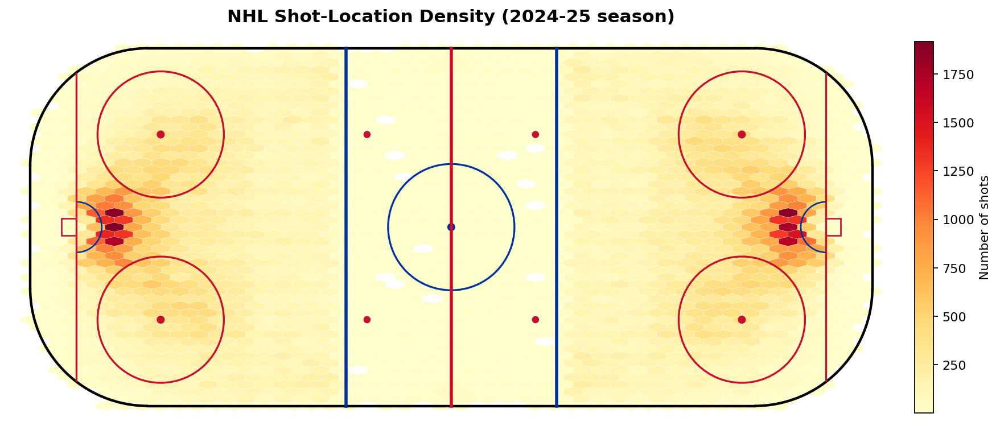

# 🏒 NHL Expected Goals (xG) Analytics


A machine-learning system for predicting **Expected Goals (xG)** in NHL hockey — pairing a Python/FastAPI modeling backend with a Vue 3 visualization frontend. Originally built as a hockey analytics R&D project centered on the Pittsburgh Penguins.

> **xG (Expected Goals)** estimates the probability that a given shot becomes a goal, based on its context — location, angle, shot type, rebounds, rushes, pre-shot passing, goalie workload, and game state.

## Shot-location heatmap

Density of ~330k NHL shots across two seasons — note the high-frequency clustering in the slot directly in front of each net, exactly where xG is highest.



---

## Repository structure

```
nhl-xg-analytics/
├── backend/      Python · FastAPI · XGBoost xG model, training scripts, feature engineering
└── frontend/     Vue 3 · TypeScript · Vite — interactive rink + shot visualizations
```

Each side has its own README with deeper detail:
- [backend/README.md](backend/README.md)
- [frontend/README.md](frontend/README.md)

---

## What it does

- **xG model** — predicts shot-success probability from NHL play-by-play data
- **Feature engineering** — shot distance/angle, rebounds, rush quality, royal-road passes, on-ice quality differentials, goalie fatigue/workload, momentum, and pre-shot passing sequences
- **REST API** — FastAPI service for real-time predictions
- **Rink visualization** — Vue frontend rendering shot locations and heatmaps on an NHL rink

## Tech stack

| Layer | Tools |
|-------|-------|
| Modeling | Python, XGBoost, scikit-learn, pandas, numpy |
| API | FastAPI |
| Frontend | Vue 3, TypeScript, Vite |
| Data source | [NHL public API](https://api-web.nhle.com/v1/) |

---

## Try the model in 30 seconds

The trained xG model **ships in this repo** (a ~1 MB XGBoost model), so you can score shots immediately — no data download, no server, no GPU:

```bash
cd backend
python -m venv .venv
# Windows: .venv\Scripts\activate   |   macOS/Linux: source .venv/bin/activate
pip install -r requirements.txt        # or: pip install xgboost scikit-learn pandas joblib
python predict.py
```

Output:
```
NHL Expected Goals (xG) — sample predictions
====================================================
 92.5% xG   Slot one-timer off a rebound (high danger)
 26.5% xG   Point slap shot from the blue line (low danger)
 34.5% xG   Sharp-angle wrister, off the rush
====================================================
```

Score your own shot from Python:
```python
from predict import predict_xg
predict_xg(arenaAdjustedShotDistance=8, shotAngleAdjusted=5, shotRebound=1)  # -> xG probability
```

The model takes 42 features (shot geometry, shot type, rebound/rush context, on-ice strength, and shooter/goalie talent). The full list is in [backend/models/production/features.txt](backend/models/production/features.txt), with importances in [feature_importance.csv](backend/models/production/feature_importance.csv).

> ℹ️ **A larger model is also available.** This repo ships the lightweight **single-XGBoost** model for instant, portable inference. The project also trained a heavier **AutoGluon ensemble** (XGBoost + LightGBM + CatBoost + neural nets, ~260 MB) that squeezes out additional accuracy and powers the full FastAPI server in [backend/api/](backend/api/). It's too large to commit here — open an issue if you'd like access or see [backend/train/train_autogluon.py](backend/train/train_autogluon.py) to regenerate it.

### Frontend
```bash
cd frontend
npm install
npm run dev
```

---

## Note on data & full models

Raw datasets, processed CSVs, and the large model binaries (the AutoGluon ensemble, neural models) are **not** included — they are regenerated from the NHL API via the scripts in [backend/scripts/](backend/scripts/) and [backend/train/](backend/train/). Only the lightweight production xG model is bundled. See [backend/training_docs/](backend/training_docs/) for the data dictionary and feature documentation.

## License

Released under the [MIT License](LICENSE).
